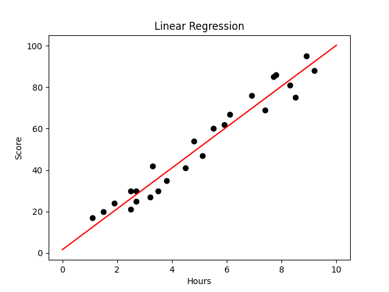

## Requirements

To run this code, you will need to have Python 3 installed on your machine. Additionally, the following Python libraries are required:
 - pandas
 - matplotlib

```bash
  pip install -r Requirements.txt
```

## Usage

The main functionality of linear regression is contained in `main.py`
    
## Result Plot

